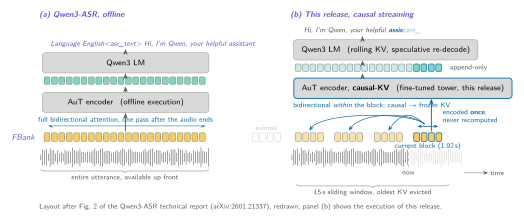
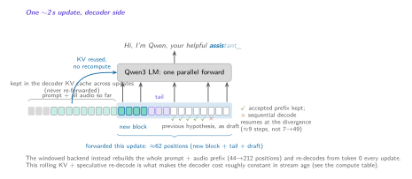
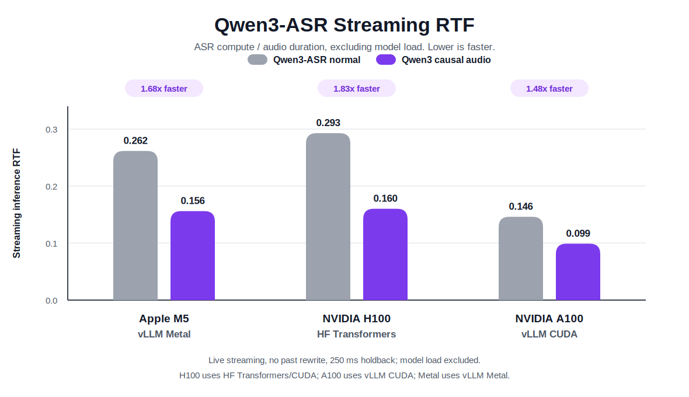

# Qwen3-ASR causal

Standalone runtime for the causal streaming audio tower published at
[qfuxa/qwen3-asr-0.6b-streaming](https://huggingface.co/qfuxa/qwen3-asr-0.6b-streaming).

The weights are not stored in this repository. The runtime downloads the causal
tower from Hugging Face and loads the unchanged decoder, adapter and feature
extractor from [Qwen/Qwen3-ASR-0.6B](https://huggingface.co/Qwen/Qwen3-ASR-0.6B).



## Install

```bash
pip install -e ".[streaming]"
```

For CUDA/vLLM serving, including the causal audio tower path:

```bash
pip install -e ".[vllm]"
```

For Apple Silicon vLLM Metal serving, install vLLM with the official
vllm-metal instructions first, then install the Metal extra:

```bash
pip install -e ".[metal]"
```

## Usage

HF Transformers causal runtime:

```bash
qwen3-asr-causal transcribe audio.wav --backend hf --language en
```

vLLM CUDA runtime with the live prompt-embedding append path:

```bash
WLK_QWEN3_VLLM_LIVE_MULTIPROCESSING=1 \
qwen3-asr-causal transcribe audio.wav \
  --backend vllm \
  --decoder-backend vllm-live \
  --language en
```

The conservative vLLM fallback uses text-decoder prefix caching:

```bash
qwen3-asr-causal transcribe audio.wav \
  --backend vllm \
  --decoder-backend vllm-text \
  --language en
```

The Apple Silicon backend exposes the same runtime through
`qwen3_asr_causal.metal` for WhisperLiveKit and local benchmark integration.

## How it works

The original Qwen3-ASR audio tower is offline and fully bidirectional. This
runtime uses a fine-tuned causal tower that runs append-only:

- fixed 1.92 s audio blocks, with full attention inside each block;
- causal per-layer KV across blocks;
- bounded 15 s left attention window;
- monotonically increasing sinusoidal positions;
- no re-encoding of already finalized audio blocks.



The live text contract is append-only. At each non-final update the runtime
cuts the hypothesis portion aligned to the last 250 ms of audio and only
publishes text that extends the previously published prefix. End of stream
flushes the held-back tail, but still cannot revise words already published.

## Results

Long-form evaluation: 21 MCIF/ACL conference talks, about 2 h total, accented
scientific English, human references, Whisper text normalization.

| system | scoring contract | WER | compute per second of audio |
|---|---|---:|---|
| Streaming Qwen3-ASR | no rewrite, 250 ms tail cut + EOS flush | **12.6** | 126 GFLOPs avg, growing to 172 within each segment |
| Streaming Qwen3-ASR causal | no rewrite, 250 ms tail cut + EOS flush | **18.1** | **42 GFLOPs, constant** |



Streaming RTF is ASR compute divided by audio duration, excluding model load.
The H100 bars are pure HF Transformers/CUDA. The A100 bars are vLLM CUDA.
The Metal bars use vLLM Metal on Apple Silicon.

Key numbers:

- H100 HF Transformers: normal windowed 0.293 RTF, causal 0.160 RTF.
- Apple M5 vLLM Metal: normal 0.262 RTF, causal 0.156 RTF.
- A100 vLLM CUDA: normal 0.146 RTF, causal `vllm-live` 0.099 RTF.
- The A100 `vllm-text` fallback measured 0.113 RTF on the same 22 s smoke.

These speed smokes are not WER claims; use the long-form WER table above for
quality comparisons.

## Python

```python
from qwen3_asr_causal import Qwen3StreamingASR, Qwen3StreamingOnlineProcessor

asr = Qwen3StreamingASR(
    lan="en",
    model_size="Qwen/Qwen3-ASR-0.6B",
    qwen3_streaming_audio_backend="causal",
    qwen3_streaming_tower_checkpoint="qfuxa/qwen3-asr-0.6b-streaming",
)
processor = Qwen3StreamingOnlineProcessor(asr)
```

## Development

Default tests are lightweight and do not download Qwen weights:

```bash
python -m py_compile $(find src/qwen3_asr_causal -name "*.py")
pytest -q
```

Real inference is opt-in:

```bash
QWEN3_ASR_CAUSAL_E2E=1 pytest tests/test_e2e.py
```

The ongoing research notebooks, training scripts, run logs, and WER/RTF
benchmarks live in `experiments/qwen3-causal/` and `benchmarks/`. WhisperLiveKit
imports this package instead of carrying a second copy of the Qwen runtime.

## License

Apache-2.0.
